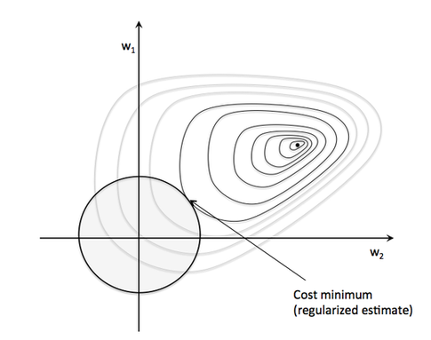

# Basic R Markdown

Install the rmarkdown package

This is a latex equation, $E = mc^{2}$

This is a inline code `print("this is an inline code")`

Set echo = TRUE if you want to include source code in the output

```{r setup, include=FALSE}
knitr::opts_chunk$set(echo = TRUE)
```

For Spanish beginners see: https://markdown.es/sintaxis-markdown/

R Markdown Cheat Sheet: https://www.rstudio.com/wp-content/uploads/2015/02/rmarkdown-cheatsheet.pdf 

Other good one: https://guides.github.com/pdfs/markdown-cheatsheet-online.pdf 

Latex symbols: https://en.wikibooks.org/wiki/LaTeX/Mathematics 

# Binary classification

Binary or binomial classification is the task of classifying the elements of a given set into two groups (predicting which group each one belongs to) (@binaryClassification).

An example:


# Logistic Regression

In statistics, logistic regression, or logit regression, or logit model[1] is a regression model where the dependent variable (DV) is categorical (@logisticRegression).

Find the maths here:

Given $x$ and $y$ find $\hat{y}$ such as $\hat{y} =  P(y = 1 | x)$ where $0 \leq \hat{y} \leq 1$

We need to find $w \in \mathbb{R}^n$ and $b \in \mathbb{R}$ 
where $\hat{y} = \sigma(w^Tx + b) = \sigma(z) \approx y$ and
$\sigma(z) = \frac{1}{1 + e^{-z}}$


See the graph in R

```{r}
Sigmoid <- function(x) { 
  1 / (1 + exp(-x))
}

# feed with data
x <- seq(-5, 5, 0.01)

# and plot
plot(x, Sigmoid(x), col = 'blue', ylim = c(-.2, 1))
abline(h = 0, v = 0, col = "gray60")
```

The idea is the following:

If *z* is very large $\sigma(z) \approx 1$, but if z is a large negative number $\sigma(z) \approx 0$

# Loss (error) function

As $\hat{y} \approx y$, we have a loss or error function:

The logistic regression cost function is the following:

$\ell(y, \hat{y}) = -(ylog(\hat{y}) + (1 - y)log(1 - \hat{y})$

Why this loss function?

Because if $y = 0$ we want $\hat{y}$ small, if $y = 1$ we want a large value for $\hat{y}$.
In another case, we want to penalize the result.

# Cost function

The cost function aggregates the loss function result for every $(x_{i}, y_{i})$. Given *n*, the sample size, the cost function is:
<!-- Comment: 1/n to obtain error average -->
$\jmath(w, b) = \frac{1}{n}\sum_{1}^{n}\ell(y^{i} \hat{y}^{i}) = -\frac{1}{n}\sum_{1}^{n}((y^{i}log(\hat{y}^{i}) + (y^{i} +1)log(1 - \hat{y}^{i}))$

Remember: $\hat{y} = h_{\theta} = \sigma(w^Tx + b)$ 

```{r}
# Ref: https://www.r-bloggers.com/logistic-regression-with-r-step-by-step-implementation-part-2/
# Cost Function
# 
CostFunction <- function(parameters, X, Y) {
  n <- nrow(X)
  # function to apply (%*% Matrix multiplication)
  g <- Sigmoid(X %*% parameters)
  J <- (1/n) * sum((-Y * log(g)) - ((1 - Y) * log(1 - g)))
  return(J)
}
```

So, our mission is to find *w*, and *b*, such that minimizes $\jmath(w, b)$

To find maximums and minimums we use derivatives. And here the gradient descent appears (@MachineLearningFAQ). 


And, why derivatives?


Use the **chain rule** to obtain the derivatives. 

The learning rate is paramount. If you set a very high learning rate the algorithm might not converge. On the contrary, with a very low learning rate the learning process could be slow (@learningRate).


Due to this kind of *choices*, experience is a high valueble assset (and Data Science become an **Art** in something aspects)

The algorithm is the following (\alpha represents the **learning rate**):

*Repeat until convergence*:

$w = w - \alpha\frac{\partial\jmath(w, b)}{\partial w}$
  
$b = b - \alpha\frac{\partial\jmath(w, b)}{\partial b}$
    
*end algorithm*

Then, remember we want to find W and b that **minimizes the cost function** not the $\hat{y}$ function. 

\[ \frac{\partial\jmath(w, b)}{\partial \theta_j} = \frac{1}{n} \sum\limits_{i=1}^n (h_{\theta}(x^{(i)}) - y^{(i)}) x_j^{(i)} \] (@derivateCostFunction) 

where $h_{\theta} = \sigma$

As $\frac{1}{n}$ is a constant, $\alpha\frac{1}{n}$ is constant too.  

Other way to see this, is the following. Consider the algorithm as:

*Repeat until convergence*:

$w = w - \alpha\frac{\partial\ell(y, \hat{y})}{\partial w}$
  
$b = b - \alpha\frac{\partial\ell(y, \hat{y})}{\partial b}$
    
*end algorithm*

-----

NOTE (trick for the derivatives, using the chain rule): 

Let $a$ be the sigmoid functions, such that:

$a = \sigma(z)$, $-e^{-x} = 1 - (1 + e^{-x}) = 1 - \frac{1}{a} = \frac{a-1}{a}$

----- 

An algorithm that always terminates with a desired solution in a finite number of iterations is a **finite algorithm**.

An **iterative algorithm** is said to converge when as the iterations proceed the output gets closer and closer to a specific value. Convergence to a local minimum can only be guaranteed when the function function is convex.


We can set up a stopping criterion, such as a finite number of iterations or a required improvement in the cost function. 
  
**Iterative algorithms are the core of Machine Learning**, and for this reason, **parallel computing** is so important in Machine Learning and Data Science.

# Example 

Suppose that you are an administrator of a university and you want to know the chance of admission of each applicant based on their two exams. You have historical data from previous applicants which can be used as the training data for logistic regression.  Your task is to build a classification model that estimates each applicant’s probability of admission in university (Source:coursera machine learning class and @rbloggers).

Now, we have understood classification problem that we are going to address. Let us understand the data. In data we have records of previous applicants’ two exams score and label whether applicant got admission or not (1 - if got admission 0 - otherwise).

Analyze your data

```{r}
#Load data
data <- read.csv("data/4_1_data.csv")

#Create plot
plot(data$score.1, data$score.2, col = as.factor(data$label), xlab = "Score-1", ylab = "Score-2")
```

In this case we have two predictor variables (two exams’ scores) and label as response variable. The equation is the following:

$\hat{y} = \sigma(w_1x_1 + w_2*x_2 + b)$ 

Then, remember we want to find W and b that **minimizes the cost function** not the $\hat{y}$ function. 

<!-- \[ \frac{\partial}{\partial \theta_j} = \frac{1}{n} \sum\limits_{i=1}^n (h_{\theta}(x^{(i)}) - y^{(i)}) x_j^{(i)} \] (@derivateCostFunction) -->

Let us set predictor and response variables.

```{r}
#Predictor variables
X <- as.matrix(data[, c(1,2)])

#Add ones to X in the first column (matrix multiplication x b)
X <- cbind(rep(1, nrow(X)), X)

#Response variable
Y <- as.matrix(data$label)
```


```{r}
#Intial parameters
initial_parameters <- rep(0, ncol(X))

#Cost at inital parameters
CostFunction(initial_parameters, X, Y)
```

With each step of gradient descent, parameters come closer to the optimal values that will achieve the lowest cost. To do this we will set (i.e.) the iteration parameter to 1200

```{r}
# We want to minimize the cost function. Then derivate this funcion
TestGradientDescent <- function(iterations = 1200, X, Y) {
  
  # Initialize (b, W)
  parameters <- rep(0, ncol(X))
  # Check evolution
  print(paste("Initial Cost Function value: ", 
              convergence <- c(CostFunction(parameters, X, Y)), sep = ""))
  
  # updating (b, W) using gradient update
  
  # Derive theta using gradient descent using optim function
  # Look for information about the "optim" function (there are other options)
  parameters_optimization <- optim(par = parameters, fn = CostFunction, X = X, Y = Y, 
                                   control = list(maxit = iterations))
  #set parameters
  parameters <- parameters_optimization$par
  
  # Check evolution
  print(paste("Final Cost Function value: ", 
              convergence <- c(CostFunction(parameters, X, Y)), sep = ""))

 return(parameters) 
}

# How to use
parameters <- TestGradientDescent(X = X, Y = Y)
# probability of admission for student (1 = b, for the calculos)
new_student <- c(1,25,78)
print("Probability of admission for student:")
print(prob_new_student <- Sigmoid(t(new_student) %*% parameters))
```
Is he out? :-(

Now, We're gonna to try other option

```{r}
if (!require("gradDescent")) install.packages("gradDescent")
# load
library("gradDescent")
```

New Gradient Descent version

```{r}
# We want to minimize the cost function. Then derivate this funcion
TestGradientDescent2 <- function(iterations = 1200, learning_rate = 0.25, the_data) {
  
  # label in the last column in dataSet
  model <- gradDescentR.learn(dataSet = the_data, featureScaling = TRUE, scalingMethod = "VARIANCE", 
                              learningMethod = "GD", control = list(alpha = learning_rate, maxIter = iterations), 
                              seed = 1234)
  
  model
}

# How to use
TestGradientDescent2(the_data = data)

# Now, the exercises. Use training and test set, change the value of alpha...
```

## Plus lesson - Unit test - Testing our code

Unit tests are small functions that test your code and help you make sure everything is alright. To do this in R, the *testthat* package can be used as follows:

```{r}
# Install if not installed
if (!require("testthat")) install.packages("testthat")
# load
library(testthat)
```

Now, we can check the code for the *TestGradientDescent* function.

```{r}
test_that("Test TestGradientDescent",{
  parameters <- TestGradientDescent(X = X, Y = Y)
  # probability of admission for student (1 = b, for the calculos)
  new_student <- c(1,25,78)
  prob_new_student <- Sigmoid(t(new_student) %*% parameters)
  print(prob_new_student)
  expect_equal(as.numeric(round(prob_new_student, digits = 4)), 0.0135)
  # Fail, test
  # expect_equal(as.numeric(round(prob_new_student, digits = 4)), 0.0130)
})
```


# Assignment

  1. Test the *TestGradientDescent* function with the training set (*4_1_data.csv*). Obtain the confusion matrix. 

```{r, message=FALSE, warning=FALSE}
library(caret)

data <- read.csv("data/4_1_data.csv")

## Cut off

C <- 0.5

## Predictor variables
X <- as.matrix(data[, c(1,2)])
## Add ones to X in the first column (matrix multiplication x b)
X <- cbind(rep(1, nrow(X)), X)
## Response variable
Y <- as.matrix(data$label)

## We want to minimize the cost function. Then derivate this funcion
TestGradientDescent <- function(iterations = 1200, X, Y) {
  # Initialize (b, W)
  parameters <- rep(0, ncol(X))
  # Check evolution
  print(paste("Initial Cost Function value: ",
               convergence <- c(CostFunction(parameters, X, Y)), sep = ""))
  # updating (b, W) using gradient update
  # Derive theta using gradient descent using optim function
  # Look for information about the “optim” function (there are other options)
  parameters_optimization <- optim(par = parameters, fn = CostFunction, X = X, Y = Y,
                                   control = list(maxit = iterations))
  # set parameters
  parameters <- parameters_optimization$par
    ## $par -> 	The best set of parameters found.
  # Check evolution
  print(paste("Final Cost Function value: ",
               convergence <- c(CostFunction(parameters, X, Y)), sep = ""))
  return(parameters)
}
## How to use
parameters <- TestGradientDescent(X = X, Y = Y)
parameters
## probability of admission for student (1 = b, for the calculos)
new_student <- c(1,25,78)
print("Probability of admission for student: ")
print(prob_new_student <- Sigmoid(t(new_student) %*% parameters))

## CONFUSION MATRIX

predictX  <- function(x, par = parameters, cutoff = C){
  ## Function for predicting the probability of addmiting a student from DF: X
  ## 
  return(ifelse(Sigmoid(t(x) %*% parameters) > cutoff, 1, 0))
}
expected  <- factor(Y)
predicted <- factor(apply(X, 1, predictX))
results <- confusionMatrix(data = predicted, reference = expected)
print(results)
```

  2. Obtain a graph representing how the cost function evolves depending of the number of iterations.


```{r, results = 'hide', results = 'markup'}

iterations <- data.frame("Iterations" = 0, "CostFunctionValue" = 0) 

## function has been modifies so it does not print in every iteration
TestGradientDescent2 <- function(iterations = 1200, X, Y) {
  # Initialize (b, W)
  parameters <- rep(0, ncol(X))
  # Check evolution
  convergence <- c(CostFunction(parameters, X, Y))
  # updating (b, W) using gradient update
  # Derive theta using gradient descent using optim function
  # Look for information about the “optim” function (there are other options)
  parameters_optimization <- optim(par = parameters, fn = CostFunction, X = X, Y = Y,
                                   control = list(maxit = iterations))
  # set parameters
  parameters <- parameters_optimization$par
    ## $par -> 	The best set of parameters found.
  # Check evolution
  convergence <- c(CostFunction(parameters, X, Y))
  return(parameters)
}

set.seed(131822)
for (i in seq(1:100)) {
  ## paremeter per iteration to calculate cost function 
  ## per iteration
  iterations[i,] <- c(i, CostFunction(TestGradientDescent2(iterations = i, X = X, Y = Y), X, Y))
}
```


```{r}
parameters <- TestGradientDescent(X = X, Y = Y)
parameters

###########################################

seqParameters <- data.frame(parameter1 = seq(0,parameters[1], length.out = 100),
                            parameter2 = seq(0,parameters[2], length.out = 100),
                            parameter3 = seq(0,parameters[3], length.out = 100))


values <- c()

set.seed(131822)
for (iteration in 1:nrow(seqParameters)) {
  
  values <- c(values, CostFunction(as.double(seqParameters[iteration,]), X, Y))
  
}

ggplot() + geom_point(aes(x = 1:100, y = values),shape = 21)  + xlab("Iteration") + geom_point(aes(x = iterations$Iterations , y = iterations$CostFunctionValue)) + geom_hline(yintercept =  values[length(values)], color = "steelblue", size = 2) + ggtitle("Convergence to minimum Cost")

```

  3. Explore other options using the *optim* function (see the methods section of the documentation). Explore other ways in R for estimating the Gradient Descent. 

```{r}
TestGradientDescent_different_methods <- function(iterations = 1200, X, Y, method_optim) {
  # Initialize (b, W)
  parameters <- rep(0, ncol(X))
  
  # updating (b, W) using gradient update
  
  # Derive theta using gradient descent using optim function
  # Look for information about the "optim" function (there are other options)
  parameters_optimization <- optim(par = parameters, fn = CostFunction, X = X, Y = Y, 
                                   control = list(maxit = iterations), method = method_optim)
  #set parameters
  parameters <- parameters_optimization$par
  
  # Check evolution
  return(parameters) 
}

matrix_gradientdescent_method_optim <- function(X = X, Y = Y, gradient_method_optim = "BFGS"){
  
  parameters <- TestGradientDescent_different_methods(X = X, Y = Y,
                                                      method_optim = gradient_method_optim  )
  
  #add_not_add_student: Filter students based on their scores, TestGradientDescent parameters and cut_off.
  add_not_add_student  <- function(student_scores, par = parameters, cut_off = C){
    added_as_factor <- ifelse(Sigmoid(t(student_scores) %*% parameters) > cut_off, 1, 0)
    return(added_as_factor)
  }
  
  predicted <- factor(apply(X, 1, add_not_add_student))
  expected <- factor(Y)
  results <- confusionMatrix(data = predicted, reference = expected)
  print( parameters)
  print(levels(predicted))
  print(levels(expected))
  print(results$table)
}
set.seed(131822)
matrix_gradientdescent_method_optim(X, Y, gradient_method_optim = "BFGS")
matrix_gradientdescent_method_optim(X, Y, gradient_method_optim = "SANN")
matrix_gradientdescent_method_optim(X, Y, gradient_method_optim = "CG")
'matrix_gradientdescent_method_optim(X, Y, gradient_method_optim = "L-BFGS-B")'
## problems with convergence
'matrix_gradientdescent_method_optim(X, Y, gradient_method_optim = "Brent")'
## problems with dimension; only work with one dimension
```

The optim function uses the method of __Nelder and Mead__ as default, which uses only function values and is robust but relatively slow. It will work reasonably well for non-differentiable functions.

__BFGS__ method is a quasi-Newton method that uses function values and gradients to build up a picture of the surface to be optimized. We obtain the same reslut as the default method (Nelder and Mead).
 
The __SANN__ method depends critically on the settings of the control parameters. We obtain a result but it is completely different form the above results.

The __CG__ (i.e. Conjugate gradient methods) method will generally be more fragile than the BFGS method, but as they do not store a matrix they may be successful in much larger optimization problems. Only one level is predicted so in every case we get the same value, very diferent resuts comparing the other methods.

__L-BFGS-B__ which allows box constraints, that is each variable can be given a lower and/or upper bound. The initial value must satisfy the constraints. This uses a limited-memory modification of the BFGS quasi-Newton method. If non-trivial bounds are supplied, this method will be selected, with a warning.We got problems with convergence as result.

Method __Brent__ is for one-dimensional problems only


  4. Explain why is not a trivial task to calculate the Gradient Descent. What happens if we have a very high dimensional problem?

  5. Optional (+0.5 - 1 points in final grade). 
  
  
        
      + Research about regularization in logistic regression and explain it.

Regularization is any modification we make to a learning algorithm that is intended to reduce its generalization error but not its training error. In other words: regularization can be used to train models that generalize better on unseen data, by preventing the algorithm from overfitting the training dataset.


Regularization does NOT improve the performance on the data set that the algorithm used to learn the model parameters (feature weights). However, it can improve the generalization performance, i.e., the performance on new, unseen data, which is exactly what we want. Again, we don't want the model to memorize the training dataset, we want a model that generalizes well to new, unseen data.

In more specific terms, we can think of regularization as adding (or increasing the) bias if our model suffers from (high) variance (i.e., it overfits the training data).



Intuitively, we can think of the "sphere" at the coordinate center in the figure above as our "budget." Now, our objective is still the same: we want to minimize the cost function. However, we are now constraint by the regularization term; we want to get as close as possible to the global minimum while staying within our "budget" (i.e., the sphere).


      + Implement the algorithm step by step using the update rule and an iterative algorithm, do not use the *optim* function.
      
    
```{r}

gradientDesc <- function(x, y, learn_rate, conv_threshold, n, max_iter) {
  
  m1 <- runif(1, 0, 1)
  m2 <- runif(1, 0, 1)  ## Hyper plane
  m3 <- runif(1, 0, 1)
  c <- runif(1, 0, 1)
  yhat <- m1 * x[,1] + m2 * x[,2] + m3 * x[,3] + c ## Hyper plane fit
  Cost <- CostFunction(c(m1, m2 ,m3), x, y)
  converged = F
  iterations = 0
  while (converged == F) {
    ## Implement the gradient descent algorithm
    m1_new <- m1 - learn_rate * ((1 / n) * (sum((yhat - y) * x)))
    m2_new <- m2 - learn_rate * ((1 / n) * (sum((yhat - y) * x)))
    m3_new <- m3 - learn_rate * ((1 / n) * (sum((yhat - y) * x)))
    c_new <- c - learn_rate * ((1 / n) * (sum(yhat - y)))
    m1 <- m_new
    m2 <- m_new
    m3 <- m_new
    c <- c_new
    yhat <-  m1 * x[,1] + m2 * x[,2] + m3 * x[,3] + c
    Cost_new <- CostFunction(c(m1, m2 ,m3), x, y)
    if (Cost - Cost_new <= conv_threshold) {
      
      converged = T
      return(paste("Optimal intercept:", c, "Optimal Paremeters:", c(m1, m2 ,m3)))
    }
    iterations = iterations + 1
    if (iterations > max_iter) { 
       
      converged = T
      return(paste("Optimal intercept:", c, "Optimal Paremeters:",c(m1, m2 ,m3)))
    }
  }
}

```
      


# References

---
references:
- id: template
  title: Binary classification
  author:
  - family: Fenner
    given: Martin
  container-title: Nature Materials
  volume: 11
  URL: 'http://dx.doi.org/10.1038/nmat3283'
  DOI: 10.1038/nmat3283
  issue: 4
  publisher: Nature Publishing Group
  page: 261-263
  type: article-journal
  issued:
    year: 2012
    month: 3

- id: binaryClassification
  title: Binary classification
  author:
  - family: Wikipedia - Binary Classification
  URL: 'https://en.wikipedia.org/wiki/Binary_classification'
  issued:
    year: 2017

- id: logisticRegression
  title: Logistic Regression
  author:
  - family: Wikipedia - Logistic Regression
  URL: 'https://en.wikipedia.org/wiki/Logistic_regression'
  issued:
    year: 2017
    
- id: MachineLearningFAQ
  title: Machine Learning FAQ
  author:
  - family: Raschka
    given: Martin
  URL: 'https://sebastianraschka.com/faq/docs/closed-form-vs-gd.html'
  issued:
    year: 2017

- id: learningRate
  title: Logistic Regression and Gradient Descent
  author:
  - family: Magdon-Ismail
    given: M.
  URL: 'http://www.cs.rpi.edu/~magdon/courses/LFD-Slides/SlidesLect09.pdf'
  issued:
    year: 2017

- id: rbloggers
  title: Logistic regression with R
  author:
  - family: Gondaliya
    given: Amar
  URL: 'https://www.r-bloggers.com/logistic-regression-with-r-step-by-step-implementation-part-2/'
  issued:
    year: 2013
    
- id: derivateCostFunction
  title: Derivate Cost Function for Logistic Regression
  author:
  - family: Fok
    given: Sam
  URL: 'http://sambfok.blogspot.com.es/2012/08/partial-derivative-logistic-regression.html'
  issued:
    year: 2012
---  
Some ideas from (recommended course)
https://www.coursera.org/specializations/deep-learning
