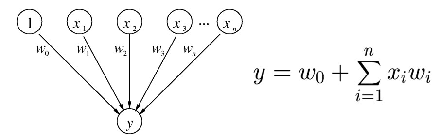

# Introduction

*In machine learning, the perceptron is an algorithm for supervised learning of binary classifiers (functions that can decide whether an input, represented by a vector of numbers, belongs to some specific class or not). It is a type of linear classifier, i.e. a classification algorithm that makes its predictions based on a linear predictor function combining a set of weights with the feature vector. The algorithm allows for online learning, in that it processes elements in the training set one at a time*(@perceptron). 

This model can solve linearly separable problems. Examples:

2D


3D


**When a problem is linearly non-separable, the Perceptron algorithm will not converge.**

The perceptron is a **key concept** in Neural Networks.

# The algorithm

The perceptron learning algorithm was developed by @rosenblatt.

This algorithm tries to find a separating hyperplane by minimizing the distance (i.e. euclidean distance, but there are many options) of misclassified points to the decision boundary. It starts with an initial guess as to the separating plane’s parameters and then updates that guess when it makes mistakes.

Visual representation (@murrell):



A perceptron defines a hyperplane in n+1 dimensional space:

$y = w_nx_n + w_{n-1}x_{n-1} + ... + w_1x_1 + w_0$

AND example:


The algorithm is the following:

```{r, eval = FALSE}
# w, x, y are vectors

"initialize w = 0"

# b parameter must also be included for the peceptron algorithm to deliver a valid separator.
# for incorrectly classified training samples b must be adjusted, too:

"while any training observation (x, y) is not classified correcty {
  set w = w + learning_rate * yx
  set b = b + learning_rate * yR^2
  # where R is some constant larger than the distance from the
  # origin to the furtherest training sample
}"
```

## Coding the algorithm

```{r}
DistanceFromPlane = function(z, w, b) {
  sum(z * w) + b
}

ClassifyLinear = function(x, w, b) {
  distances = apply(x, 1, DistanceFromPlane, w, b)
  return(ifelse(distances < 0, -1, +1))
}

EuclideanNorm <- function(x) {
  return(sqrt(sum(x * x)))
}

PerceptronFunction <- function(x, y, learning.rate = 1) {
  w = vector(length = ncol(x)) # initialize w
  b = 0 # Initialize b
  iterations = 0 # count iterations
  R = max(apply(x, 1, EuclideanNorm))
  convergence = FALSE # to enter the while loop
  while (!convergence) {
    convergence = TRUE # hopes luck
    yc <- ClassifyLinear(x, w, b)
    for (i in 1:nrow(x)) {
      if (y[i] != yc[i]) {
        convergence <- FALSE
        w <- w + learning.rate * y[i] * x[i,]
        b <- b + learning.rate * y[i] * R^2  ## como b es la constante, es la que mas mueve con respecto
        iterations <- iterations + 1         ##  al origen
      }
    }
  }
s = EuclideanNorm(w)
return(list(w = w/s, b = b/s, steps = iterations))
}
```

Generate data:

```{r}
# very easy
# x2 = x1 + 1/2
set.seed(1)
x1 <- runif(100,-1,1)
x2 <- runif(100,-1,1)
x <- cbind(x1,x2)
y <- ifelse(x2 > 0.5 + x1, +1, -1)

PlotData <- function(x, y) {
  plot(x, pch = ifelse(y > 0, "+", "-"), xlim = c(-1,1), ylim = c(-1,1), cex = 2)
  abline(0.5,1)
  points(c(0,0), c(0,0), pch = 19)
  lines(c(0,-0.25), c(0,0.25), lty = 2)
  arrows(-0.3, 0.2, -0.4, 0.3)
  text(-0.45, 0.35, "w", cex = 2)
  text(-0.0, 0.15, "b", cex = 2)
}

PlotData(x, y)
```

Test the perceptron

```{r}
the_perceptron <- PerceptronFunction(x,y)
predicted_y <- ClassifyLinear(x, the_perceptron$w, the_perceptron$b)
# error
print(the_perceptron)
print(sum(abs(y - predicted_y)))
```

# Assignment

## Try other learning rates. 

Which one is the cost function? Explain the algorithm (help: http://www.dbs.ifi.lmu.de/Lehre/MaschLernen/SS2014/Skript/Perceptron2014.pdf)

Explaining the functions previosuly defined for a better understandig of the perceptron:

  * The distance of one point to a plane (hyperplane) is 
  
  $$d(p,\pi) = \frac{|Ax + By + Cz + D|}{\sqrt[]{A^2 + B^2 + C^2}}$$

  * The distinace of one point to a line is
  
  $$d(p,\pi) = \frac{|Ax + By + C|}{\sqrt[]{A^2 + B^2}}$$ 
  
  (@Distancia)(@Norma)
  
  * The function DistanceFromPlane defines the plane (or straight line; like in the example of $x_1$ and $x_2$) generated by the elements of Z and the weights in W adding a cosntant b (in two dimensions w is the vector for generating the slope and b is the intercept) returning the distance of the points in z to the plane.
  
  * The function ClassifyLinear is a linear classifier function that classifies every point bellow the plane as -1 and every point over the plane as +1, this plane is generated by W and b and returns a distance of x to the plane with the previous funtion.
  
  * The function EuclidianNorm calculates the distance of a point to the origin. This is the length of the vector thats goes form the origin to a point.
  
  * The PerceptronFunction iterates changing the parameters of the plane until every point is correctly classified by a linear classification (assuming that the set is __linearly separable__ by a linear rule using the characteristics in Z; in the example $x_1$ and $x_2$). In every iteration, if any point is misclassified, then w ans b are modified toward the optimal. W is modified by $y[i]x[i,]$; when $y[i]$ is -1 it will subtract the value of $x_1$ to $w_1$ and $x_2$ to $w_2$; if $y[i]$ its equal to one this vlaues will be added respectively (adjusted by the learning rate). On the other side, b is adjusted in every iteration by adding/substractng $R^2$ (adding when $y[i]$ is 1 which means that a -1 was assing to this pint so we want to move the plane upwards to correct the misclassification; and the same logic when substracting; $y[i]$ equal to -1 but 1 was assigned so the plane must be moved downward for correct classification). $R$ is the largest distance of any given point X in the sample to the origin (0,0). Both adjustments are made for every misclasified point befaore a new classification is proposed with ClassifyLinear. The fact that no point is misclassified is the same as saying that the cost function is minimize (in this case 0; which is the minimum value); the cost function is defined as the following:

On the slides of "The Perceptron" by Volker Tresp (@ThePerceptron), the author defines the Linear classifier as one of the simplest but also one of the most powerfull classifiers. A linear classifier can be realized through a Perceptron, a single formalized neuron.

  * The activation function of the Perceptron is weighted sum of inputs.
  
  * The binary clasiffication $y_{i} \operatorname{in} \{1,-1\} $ (only two values; i.e. binary clasification) and is calulated as $\hat{y}_{i} = \operatorname{sign}(h_{i}) $ wheere $h_{i}$ is the linear clasification boundry. 


### The cost function:

$$
\operatorname{cost}=-\sum_{i \in \mathcal{M}} y_{i} h_{i}=\sum_{i=1}^{N}\left|-y_{i} h_{i}\right|_{+}
$$

When the proposed classification by  $h_{i}$ is right, the cost= 0. This is why:
$-y_{i}h_{i}$ will be -1 if $h_{i}$ is well classified ($h_{i} = y_{i}$), because if $y_{i}h_{i}$:
- Both with negative values, will give us as a result a positive number. Which due to the "-" in front of them $-y_{i}h_{i}$  will give a -1.
- Both with positive values, will give us as a result a positive number. Which due to the "-" in front of them $-y_{i}h_{i}$  will give a -1.
These operators $\left|\right|_{+}$ mean that $|a r g|_{+}=\max (a r g, 0)$, so that the result of $\left|-y_{i} h_{i}\right|_{+}$ will give as a max value "0", if we get a negative number like "-1"as the argument.

In other words:

  * The cost function is equal to the total number of incorrect classifications in any given iteration.

  * When the porposed clasification is incorrect, the value of the product $y_{i}h_{i}$ will be negative because if y was 1 and h is -1, the product results in -1; and viceversa. Then $\left|-y_{i} h_{i}\right|_{+}$ will be equal to one and it will be added to the cost function increasing it's value while it walks away form it's minimum value. But, if the proposed classification is correct the product will result in 1, then $\left|-y_{i} h_{i}\right|_{+}$ will equal 0, not adding to the cost function and walking forwars the optimum value, 0.

Summarizing the algorithm objective:

  * Define learning rule to find optimal parameters $w_0, . . . , w_M−1$
  
  * Define a cost function that is dependent on the training data and the parameters
  
  * In the learning process (training), one attempts to find parameters that minimize the cost function
  
  * Goal: correct __linear__ classification of the N training samples $\{y_1, . . . , y_N\}$


### Trying different learning rates

Now different learning rates will be tried in order to check:

```{r}
the_perceptron <- PerceptronFunction(x,y, learning.rate = .5)
predicted_y <- ClassifyLinear(x, the_perceptron$w, the_perceptron$b)
# error
print(the_perceptron)
print(sum(abs(y - predicted_y)))
```

```{r}
the_perceptron <- PerceptronFunction(x,y, learning.rate = .01)
predicted_y <- ClassifyLinear(x, the_perceptron$w, the_perceptron$b)
# error
print(the_perceptron)
print(sum(abs(y - predicted_y)))
```

```{r}
the_perceptron <- PerceptronFunction(x,y, learning.rate = .001)
predicted_y <- ClassifyLinear(x, the_perceptron$w, the_perceptron$b)
# error
print(the_perceptron)
print(sum(abs(y - predicted_y)))
```

```{r}
the_perceptron <- PerceptronFunction(x,y, learning.rate = .000000001)
predicted_y <- ClassifyLinear(x, the_perceptron$w, the_perceptron$b)
# error
print(the_perceptron)
print(sum(abs(y - predicted_y)))
```

```{r}
the_perceptron <- PerceptronFunction(x,y, learning.rate = .000000000000000000000000000000000001)
predicted_y <- ClassifyLinear(x, the_perceptron$w, the_perceptron$b)
# error
print(the_perceptron)
print(sum(abs(y - predicted_y)))
```


  * One way of being sure that the perceptron has found the correct answer is by comparing the w1, w2 and b with the original clasification rule line equation (which is the optimal linear classificator; but not the only one - it will depend of the data set).
  
  $$
  x_2 = x_1 + \frac{1}{2}
  $$

  * By dividing w1 and b by -w2, the ending line equation must match (aproximately - because of many possible linear classificators).
  

```{r}
the_perceptron <- PerceptronFunction(x,y, learning.rate = .000000000000000000000000000000000001)
# error
print(the_perceptron)

## Slope value close to one?
round(the_perceptron$w[1]/(-the_perceptron$w[2]),1) == 1

## Intercept close to 0.5?
round(the_perceptron$b/(-the_perceptron$w[2]),1) == 0.5
```

## Try to plot the plane (or the line) every *z* iterations:

  * By modifying the PlotData Function and the Perceptron Function, we show how the straight line changes its slope and intercept for every iteration seeking to minimize the cost fucntion.

```{r}
# very easy
# x2 = x1 + 1/2
set.seed(1)
x1 <- runif(20,-1,1) ## only 20 because qe don't want too many of plots
x2 <- runif(20,-1,1)
x <- cbind(x1,x2)
y <- ifelse(x2 > 0.5 + x1, +1, -1)

## Modification of previously defined function so diferent lines are plotted 
PlotData2 <- function(x, y, b, w) {
  plot(x, pch = ifelse(y > 0, "+", "-"), xlim = c(-5,5), ylim = c(-5,5), cex = 2)
  abline(a = b,b = w)
}


PerceptronFunction2 <- function(x, y, learning.rate = 1) {
  w = vector(length = ncol(x)) # initialize w
  b = 0 # Initialize b
  iterations = 0 # count iterations
  R = max(apply(x, 1, EuclideanNorm))
  convergence = FALSE # to enter the while loop
  while (!convergence) {
    convergence = TRUE # hopes luck
    yc <- ClassifyLinear(x, w, b)
    for (i in 1:nrow(x)) {
      if (y[i] != yc[i]) {
        convergence <- FALSE
        w <- w + learning.rate * y[i] * x[i,]
        b <- b + learning.rate * y[i] * R^2  ## como b es la constante, es la que mas mueve con respecto
        iterations <- iterations + 1         ##  al origen
        PlotData2(x, y, -b/w[2], -w[1]/w[2])
      }
    }
  }
}
```


```{r}
PerceptronFunction2(x, y)
```


### Ploting the Cost Funtion

```{r}
set.seed(1)
x1 <- runif(100,-1,1)
x2 <- runif(100,-1,1)
x <- cbind(x1,x2)
y <- ifelse(x2 > 0.5 + x1, +1, -1)
## Calculating the cost function per iteration
PerceptronFunction3 <- function(x, y, learning.rate = 1) {
  w = vector(length = ncol(x)) # initialize w
  b = 0 # Initialize b
  iterations = 0 # count iterations
  R = max(apply(x, 1, EuclideanNorm))
  convergence = FALSE # to enter the while loop
  costFunctionPerIteration <- c() # initialize cost function
  while (!convergence) {
    convergence = TRUE # hopes luck
    yc <- ClassifyLinear(x, w, b)
    for (i in 1:nrow(x)) {
      if (y[i] != yc[i]) {
        convergence <- FALSE
        w <- w + learning.rate * y[i] * x[i,]
        b <- b + learning.rate * y[i] * R^2  ## como b es la constante, es la que mas mueve con respecto
        iterations <- iterations + 1         ##  al origen
        costFunctionPerIteration <- c(costFunctionPerIteration, sum(y != ClassifyLinear(x, w, b)))
      }
    }
  }
costFunctionPerIteration <- c(costFunctionPerIteration, sum(y != yc)) ## once every point is correclty
return(costFunctionPerIteration)                                      ##   classified
}

plot(PerceptronFunction3(x, y), type = "l", ylab = "Cost Function", xlab = "Iteration", ylim = c(-1,max(PerceptronFunction3(x, y))))
abline(h = 0, col = "red")
```


```{r}
set.seed(1)
x1 <- runif(100,-1,1)
x2 <- runif(100,-1,1)
x <- cbind(x1,x2)
y <- ifelse(x2 > 0.5 + x1, +1, -1)
## Calculating the cost function per iteration
PerceptronFunction3 <- function(x, y, learning.rate = 1) {
  w = vector(length = ncol(x)) # initialize w
  b = 0 # Initialize b
  iterations = 0 # count iterations
  R = max(apply(x, 1, EuclideanNorm))
  convergence = FALSE # to enter the while loop
  costFunctionPerIteration <- c() # initialize cost function
  while (!convergence) {
    convergence = TRUE # hopes luck
    yc <- ClassifyLinear(x, w, b)
    for (i in 1:nrow(x)) {
      if (y[i] != yc[i]) {
        convergence <- FALSE
        w <- w + learning.rate * y[i] * x[i,]
        b <- b + learning.rate * y[i] * R^2  ## como b es la constante, es la que mas mueve con respecto
        iterations <- iterations + 1         ##  al origen
        costFunctionPerIteration <- c(costFunctionPerIteration, sum(y != ClassifyLinear(x, w, b)))
        yc <- ClassifyLinear(x, w, b)
      }
    }
  }
costFunctionPerIteration <- c(costFunctionPerIteration, sum(y != yc)) ## once every point is correclty
return(costFunctionPerIteration)                                      ##   classified
}

plot(PerceptronFunction3(x, y), type = "l", ylab = "Cost Function", xlab = "Iteration", ylim = c(-1,max(PerceptronFunction3(x, y))))
abline(h = 0, col = "red")
```


3. Try another example with new random data (please, do not use the iris data). Use a *complex* dataset looking for a non-completely linearly separated sample. 

Use the RMarkdown format

# References

---
references:
- id: template
  title: Binary classification
  author:
  - family: Fenner
    given: Martin
  container-title: Nature Materials
  volume: 11
  URL: 'http://dx.doi.org/10.1038/nmat3283'
  DOI: 10.1038/nmat3283
  issue: 4
  publisher: Nature Publishing Group
  page: 261-263
  type: article-journal
  issued:
    year: 2012
    month: 3
    
- id: perceptron
  title: Perceptron
  author:
  - family: Wikipedia - Perceptron
  URL: 'https://en.wikipedia.org/wiki/Perceptron'
  issued:
    year: 2017

- id: rosenblatt
  title: The Perceptron. A Probabilistic Model for Information Storage and Organization in the Brain
  author:
  - family: Rosenblatt
  given: Frank
  container-title: Psychological Review
  volume: 65
  issue: 6
  publisher: American Psychological Association
  page: 386–408
  type: article-journal
  issued:
    year: 1958

- id: murrell
  title: Linear Classifiers and the Perceptron Algorithm
  author:
  - family: Murrell
  given: Hugh
  URL: 'http://www.cs.ukzn.ac.za/~hughm/dm/content/slides07.pdf'
  issued:
    year: 2017
    
- id: ThePerceptron
  title: The Perceptron
  author:
  - family: Tresp
  given: Volker
  URL: 'http://www.dbs.ifi.lmu.de/Lehre/MaschLernen/SS2014/Skript/Perceptron2014.pdf'
  issued:
    year: 2014
    
- id: Norma
  title: Norma
  author:
  - family: Wikipedia - Norma Vectorial
  URL: 'https://es.wikipedia.org/wiki/Norma_vectorial'
  issued:
    year: 2019
    
- id: Distancia
  title: Distancia a un plano
  author:
  - family: Ditutor
  URL: 'https://www.ditutor.com/distancias/punto_plano.html'
  issued:
    year: 2019
---