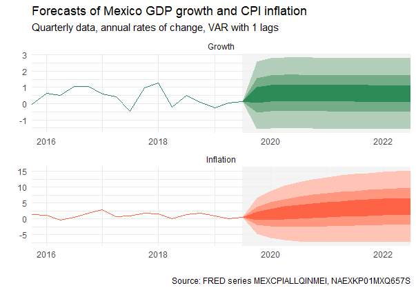

# Objectives

Forecast Mexico's GDP growth and inflation using a Vector auto-regresive or VAR model, generate a fanchart plot just as Central Banks arround the world do as a way of explaining uncertainty . All this work self-contained in chunks of code. This work is based on "Build-your-own fancharts in R" blog post by Andrew Blake.

# Conlcusions

```{r ,out.width='40%', echo=FALSE, fig.align='center'}

```

Due to the high levels of inflation (compared to GDP growth) of the Mexican economy, the inflation forecast shows a positive trend and wide forecast intervals due to uncertainty. On the other hand, the magnitude of GDP growth is undermined by the magnitude of inflation, which has greater magnitude and greater uncertainty.

```{r ,out.width='40%', echo=FALSE, fig.align='center'}

```

Without the scale, it seems that GDP growth shows little or no change in the forecast, which means that it is expected to have a behavior similar to what it had in the past.

Vector autoregression (VAR) is a stochastic process model used to capture the linear interdependencies among multiple time series. 

# Excecutive Summary

## Exploratory Data Analysis

```{r ,out.width='40%', echo=FALSE, fig.align='center'}

```

As you can see in the chart, there have been son past events when inflation had a hike and GDP growth a downturn, having in some cases negative GDP growth. Here are some of the most important events that explain these events.

The macroeconomic policies of the 1970s left Mexico's economy highly vulnerable to external conditions. These turned sharply against Mexico in the early 1980s, and caused the worst recession since the 1930s, with the period known in Mexico as La Década Perdida, "the lost decade", i.e., of economic growth. By mid-1981, Mexico was beset by falling oil prices, higher world interest rates, rising inflation, a chronically overvalued peso, and a deteriorating balance of payments that spurred massive capital flight. This disequilibrium, along with the virtual disappearance of Mexico's international reserves—by the end of 1982 they were insufficient to cover three weeks' imports—forced the government to devalue the peso three times during 1982. The devaluation further fueled inflation and prevented short-term recovery. Cut off from additional credit, the government declared an involuntary moratorium on debt payments in August 1982, and the following month it announced the nationalization of Mexico's private banking system. 

Due to the financial crisis that took place in 1982, the total public investment on infrastructure plummeted from 12.5% of GDP to 3.5% in 1989. After rising during the early years of Salinas' presidency, the growth rate of real GDP began to slow during the early 1990s. During 1993 the economy grew by a negligible amount, but growth rebounded to almost 4 percent during 1994, as fiscal and monetary policy were relaxed and foreign investment was bolstered by United States ratification of the North American Free Trade Agreement (NAFTA). The nuevo peso (new peso) was the result of hyperinflation in Mexico. In 1993, President Carlos Salinas de Gortari stripped three zeros from the peso, creating a parity of 1 new peso for 1000 of the old ones.

January 1, 1994, the North American Free Trade Agreement, signed by Mexico, the United States, and Canada went into effect. The collapse of the new peso in December 1994 and the ensuing economic crisis caused the economy to contract by an estimated 7 percent during 1995. Investment and consumption both fell sharply, the latter by some 10 percent.

The latest decline in GDP growth in the graph shows the effect of the global subprime crisis that affected the economy of all countries in the world, showing how connected the different economies are due to globalization.

## VAR Model

VAR models generalize the univariate autoregressive model (AR model) by allowing for more than one evolving variable. All variables in a VAR enter the model in the same way: each variable has an equation explaining its evolution based on its own lagged values, the lagged values of the other model variables, and an error term. VAR modeling does not require as much knowledge about the forces influencing a variable as do structural models with simultaneous equations: The only prior knowledge required is a list of variables which can be hypothesized to affect each other intertemporally.

Before a VAR model can estimated some conditions need to checked, in order for it to work and so that we can trust the results. In statistics, the Dickey–Fuller test tests the null hypothesis that a unit root is present in an autoregressive model. The alternative hypothesis is different depending on which version of the test is used, but is usually stationarity or trend-stationarity. 

* The DF test for GDP growth

```{r ,out.width='40%', echo=FALSE, fig.align='center'}
knitr::include_graphics('Images/df growth.png')
```

* The DF test for Inflation

```{r ,out.width='40%', echo=FALSE, fig.align='center'}
knitr::include_graphics('Images/df inf.png')
```

Additionaly, the correlation between the variables is aproximately -30%.

Since both variables are stationary and relatively correlated we can proceed with the VAR modelling.

A VAR model is used to explain and forecast GDP growth explained by previous GDP growth and past inflation rates (in this case, the last four; that is, 4 lags); similarly for inflation.

Algebraically a VAR with m lags is:

$$ Y_t = \beta_0 +\sum_{i=1}^{m} \beta_i Y_{t-i} + \varepsilon_t $$

where Y_t  is a vector of growth and inflation in each period.

|               	| Growth        	| Inflation   	|
|---------------	|---------------	|-------------	|
| Growth_01     	| 0.214085704   	| -0.18339705 	|
| Growth_02     	| 0.065439664   	| 0.22668919  	|
| Growth_03     	| -0.185920008  	| -0.11017714 	|
| Growth_04     	| 0.005855782   	| -0.05407754 	|
| Inflation_01  	| -0.064959245  	| 0.82083493  	|
| Inflation_02  	| 0.018076456   	| -0.07978091 	|
| Inflation_03  	| 0.009571780   	| 0.07038020  	|
| Inflation_04  	| 0.028331103   	| 0.09247628  	|
| constant      	| 0.528814757   	| 0.51350587  	|


Using the vars package, the estimated model is a VAR with only one lag for both Growth and Inflation based on information Criteria. 

The estimation of the coefficients as estimated before:

|               	| Growth      	| Inflation    	|
|---------------	|-------------	|--------------	|
| Growth_01     	| 0.28404783  	| -0.003601816 	|
| Inflation_01  	| -0.01560747 	| 0.873311805  	|
| constant      	| 0.48941839  	| 0.614990402  	|

The estimation of the coeficientes with vars package:

|               	| Growth      	| Inflation    	|
|---------------	|-------------	|--------------	|
| Growth_01     	| 0.28405     	| -0.003602   	|
| Inflation_01  	| -0.01561    	| 0.873312     	|
| constant      	|  0.48942    	| 0.614990    	|


Analysing both cases (i.e. )


## Conlcusions

Vector autoregression (VAR) is a stochastic process model used to capture the linear interdependencies among multiple time series.

```{r ,out.width='40%', echo=FALSE, fig.align='center'}

```

Due to the high levels of inflation (compared to GDP growth) of the Mexican economy, the inflation forecast shows a positive trend and wide forecast intervals due to uncertainty. On the other hand, the magnitude of GDP growth is undermined by the magnitude of inflation, which has greater magnitude and greater uncertainty.

```{r ,out.width='40%', echo=FALSE, fig.align='center'}

```

Without the scale, it seems that GDP growth shows little or no change in the forecast, which means that it is expected to have a behavior similar to what it had in the past.
 
The model with only one lag:

```{r ,out.width='40%', echo=FALSE, fig.align='center'}

```

Finaly, both series seem to have some influence on the other series based on the coefficients of the model. But looking closely at the Impulse responses, growth creates a response on itself and on Inflation. The first impulse generates an impulse in the short term that inmediately tends to fall toward the stable level; while the inlfation decreases in the short term tending towards stable level but with a permanent level.

```{r ,out.width='40%', echo=FALSE, fig.align='center'}
knitr::include_graphics('Images/resp g.png')
```

The Impulse responses created by Inflation affects both growth and on Inflation. The first impulse generates its not crearly apreciable (due to scale) but it has a permanent effect on Growth; while the inlfation increases in the short term and continues to be above the stable level with a downward trend.

```{r ,out.width='40%', echo=FALSE, fig.align='center'}
knitr::include_graphics('Images/resp i.png')
```

# References 

* https://bankunderground.co.uk/2019/11/19/build-your-own-fancharts-in-r/ 
* https://en.wikipedia.org/wiki/Vector_autoregression
* https://www.stlouisfed.org/
* https://fred.stlouisfed.org/series/MEXCPIALLQINMEI
* https://fred.stlouisfed.org/series/NAEXKP01MXQ657S
* https://en.wikipedia.org/wiki/Dickey%E2%80%93Fuller_test


## Anexos

```{r, message=FALSE, warning=FALSE}
library(tidyverse)
library(quantmod)   # For data access
library(ggplot2)
library(tseries)
```

```{r, message=FALSE}
series = c('MEXCPIALLQINMEI', 'NAEXKP01MXQ657S') # FRED codes for US GDP growth and CPI
CPI    = getSymbols(series[1], src = 'FRED', auto.assign = FALSE)
Growth = getSymbols(series[2], src = 'FRED', auto.assign = FALSE)
```

The next bit of code stores the data series in Data along with the date, calculates the annual inflation rate and then keeps only what’s necessary.

```{r}
Data = inner_join(tibble(Date = time(Growth), Growth = coredata(Growth)), 
                   tibble(Date = time(CPI), CPI = coredata(CPI)), by = c("Date")) %>% 
  mutate(Inflation = 100 * (CPI/lag(CPI) - 1)) %>%
  select(Date, Growth, Inflation) %>% 
  drop_na() # Drop missing obs to balance dataset
```

### Stationary

```{r}
adf.test(Data$Growth, k = 0)
```

```{r}
adf.test(Data$Inflation, k = 0)
```

### Correlation 

```{r}
cor(Data$Growth, Data$Inflation)
```


```{r}
centre_colour = c("seagreen","tomato") # Colours for time series/centre of fancharts
tail_colour   = "gray95"               # Colour for the tails, used later but defined here 
pivot_longer(Data, cols = -Date, names_to = "Variables", values_to = "Values") %>% 
  ggplot() + 
  geom_line(aes(x = Date, y = Values, group = Variables, colour = Variables),
            size = 1.1,
            show.legend = TRUE) +
  scale_colour_manual(values = centre_colour) +
  theme_minimal() + 
  theme(legend.title = element_blank()) +
  labs(title = "Mexico GDP growth and CPI inflation", x = "", y = "",
       caption = paste0("Source: FRED series ", paste(series, collapse = ", ")))

```

Algebraically a VAR with m lags is:

$$ Y_t = \beta_0 +\sum_{i=1}^{m} \beta_i Y_{t-i} + \varepsilon_t $$

where Y_t  is a vector of growth and inflation in each period.

```{r}
m     = 4  # maximum lag in VAR
Datal = Data %>%
   pivot_longer(cols = -Date, names_to = "Names", values_to = "Values") %>%
   mutate(lag_value = list(0:m)) %>%
   unnest(cols = lag_value) %>%
   group_by(Names, lag_value) %>%
   mutate(Values = lag(Values, unique(lag_value))) %>%
   ungroup() %>%
   mutate(Names = if_else(lag_value == 0, Names,              # No suffix at lag 0
   paste0(Names, "_", str_pad(lag_value, 2, pad = "0")))) %>% # All other lags 
   select(-lag_value) %>%                                     # Drop the redundant lag index
   pivot_wider(names_from = Names, values_from = Values) %>%
   slice(-c(1:m)) %>%                                         # Remove missing lagged initial values
   mutate(constant = 1)                                       # Add column of ones at end
```

Now select the lagged values (those with a suffix) and constant as explanatory variables and the rest (except for the date) as dependent ones using a regular expression match. These are put in the matrices X and Y respectively.

```{r}
s = paste(paste0(str_pad(1:m, 2, pad = "0"), "$"), collapse = "|")
X = data.matrix(select(Datal, matches(paste0(s, "|constant"))))
Y = data.matrix(select(Datal, -matches(paste0(s, "|constant|Date"))))
```

The VAR is easy to estimate by solving for the unknown $\beta$’s using:

```{r}
(bhat = solve(crossprod(X), crossprod(X,Y)))
```

A nice feature of calculating bhat this way is that it automatically labels the output for ready interpretation. An econometrician would spend some time evaluating the statistical model, but let’s just press ahead.

### Forecast

Simulating the model to calculate the forecasts and the forecast error variances is done in a loop. A first-order representation of the VAR works best, with the small complication that the parameters need to be re-ordered.

```{r}
nv    = ncol(Y) # Number of variables
nf    = 12      # Periods to forecast
nb    = 16      # Periods of back data to plot, used later
 
v     = crossprod(Y - X %*% bhat)/(nrow(Y) - m * nv - 1)                 # Calculate error variance
bhat2 = bhat[rep(seq(1, m * nv, m), m) + rep(seq(0, m - 1), each = nv),] # Reorder for simulation
A     = rbind(t(bhat2), diag(1, nv * (m - 1), nv * m))                   # First order form - A 
B     = diag(1,nv*m,nv)                                                  # First order form - B
cnst  = c(t(tail(bhat,1)), rep(0,nv * (m - 1)))                          # First order constants
# Simulation loop
Yf     = matrix(0, nv * m, nf + 1)                # Stores forecasts
Yf[,1] = c(t(tail(Y, m)[m:1,]))                   # Lagged data
Pf     = matrix(0, nv, nf + 1)                    # Stores variances
P      = matrix(0, nv * m, nv * m)                # First period state covariance
 
for (k in 1:nf) { 
  Yf[, k + 1] = cnst + A %*% Yf[,k]
  P = A %*% P %*% t(A) + B %*% v %*% t(B)
  Pf[, k + 1] = diag(P)[1:nv]
}
```

### Fancharts

There are packages to plot fancharts too. The fanplot package actually has Bank of England fancharts built in but not in the tidyverse, although for the tidy-minded there is ggfan. But it isn’t hard to do it from scratch.

Each forecast fanchart is built up of five shaded areas, with the darkest shade representing an area expected to contain the outcome 30% of the time. Two lighter adjacent areas are the next 15% probability bands below and above the central area, and then another 15% probability bands outside these are shaded lighter still. The edges of these bands are forecast quantiles, evaluated using the values below. Starting at the bottom, each selected forecast quantile is a lower edge of a polygon and next higher quantile the upper edge. The upper coordinates need to be reversed so the perimeter lines join to make the right side of the polygon. Creating this series for each polygon and each variable is done in the code segment below in the curly-bracketed bit `{bind_rows(…)}`. And as everything in a single data frame is convenient, a last step binds in the historical data.

```{r}
qu     = c(.05, .2, .35, .65, .8, .95)  # Chosen quantiles ensures 30% of the distribution each colour
nq     = length(qu)
fdates = seq.Date(tail(Data$Date,1), by = "quarter", length.out = nf + 1) # Forecast dates
 
forecast_data = tibble(Date     = rep(fdates, 2), 
                       Variable = rep(colnames(Data)[-1], each = (nf + 1)), 
                       Forecast = c(t(Yf[1:nv,])),
                       Variance = c(t(sqrt(Pf)))) %>% 
  bind_cols(map(qu, qnorm, .$Forecast, .$Variance)) %>%         # Calculate quantiles
  select(-c("Forecast", "Variance")) %>% 
  {bind_rows(select(., -(nq + 2)),                              # Drop last quantile 
             select(., -3) %>%                                  # Drop first quantile
               arrange(Variable, desc(Date)) %>%                # Reverse order
               rename_at(-(1:2), ~ paste0("V",1:(nq - 1))) )} %>%  # Shift names of reversed ones 
  pivot_longer(cols = -c(Date, Variable), names_to = "Area", values_to = "Coordinates") %>% 
  unite(VarArea, Variable, Area, remove = FALSE) %>%              # Create variable to index polygons
  bind_rows(pivot_longer(tail(Data,nb), cols = -Date, names_to = "Variable", values_to = "Backdata"), .)

```

That’s pretty much it. Shaded rectangles made using geom_rect indicate the forecast region, the filled polygons plotted using geom_polygon define the different bands and historical data is added using geom_line. A bit of formatting, apply facet_wrap() and we’re done.

```{r , warning=FALSE}
# Band colours 'ramp' from the centre to the tail colour 
band_colours = colorRampPalette(c(rbind(tail_colour, centre_colour), tail_colour), 
                                space = "Lab")(nv * nq + 1)[-seq(1, nv * nq + 1, nq)]
 
ggplot(forecast_data) + 
  geom_rect(aes(xmin = Date[nv*nb], xmax = max(Date), ymin = -Inf, ymax = Inf),
            fill = tail_colour,
            alpha = .2) +  
  geom_polygon(aes(x = Date, y = Coordinates, group = VarArea, fill = VarArea)) +
  scale_fill_manual(values = band_colours) +
  geom_line(aes(x = Date, y = Backdata, group = Variable, colour = Variable)) +
  scale_colour_manual(values = centre_colour) +
  scale_x_date(expand = c(0,0)) +
  theme_minimal() +
  theme(legend.position = "none") +
  facet_wrap(~ Variable, ncol = 1) +
  labs(title = "Forecasts of Mexico GDP growth and CPI inflation", 
       subtitle = paste("Quarterly data, annual rates of change, VAR with", m, "lags"), 
       caption = paste("Source: FRED series", paste(series, collapse = ", ")), x = "", y = "")

```

```{r , warning=FALSE}
# Band colours 'ramp' from the centre to the tail colour 
band_colours = colorRampPalette(c(rbind(tail_colour, centre_colour), tail_colour), 
                                space = "Lab")(nv * nq + 1)[-seq(1, nv * nq + 1, nq)]


 
ggplot(forecast_data) + 
  geom_rect(aes(xmin = Date[nv*nb], xmax = max(Date), ymin = -Inf, ymax = Inf),
            fill = tail_colour,
            alpha = .2) +  
  geom_polygon(aes(x = Date, y = Coordinates, group = VarArea, fill = VarArea)) +
  scale_fill_manual(values = band_colours) +
  geom_line(aes(x = Date, y = Backdata, group = Variable, colour = Variable)) +
  scale_colour_manual(values = centre_colour) +
  scale_x_date(expand = c(0,0)) +
  theme_minimal() +
  theme(legend.position = "none") +
  facet_wrap(~ Variable, ncol = 1, scales = "free") +
  labs(title = "Forecasts of Mexico GDP growth and CPI inflation", 
       subtitle = paste("Quarterly data, annual rates of change, VAR with", m, "lags"), 
       caption = paste("Source: FRED series", paste(series, collapse = ", ")), x = "", y = "")

```

## Estimating the VAR model with R packages.


```{r, message=FALSE}
series = c('MEXCPIALLQINMEI', 'NAEXKP01MXQ657S') # FRED codes for US GDP growth and CPI
CPI    = getSymbols(series[1], src = 'FRED', auto.assign = FALSE)
Growth = getSymbols(series[2], src = 'FRED', auto.assign = FALSE)
```

The next bit of code stores the data series in Data along with the date, calculates the annual inflation rate and then keeps only what’s necessary.

```{r}
Data = inner_join(tibble(Date = time(Growth), Growth = coredata(Growth)), 
                   tibble(Date = time(CPI), CPI = coredata(CPI)), by = c("Date")) %>% 
  mutate(Inflation = 100 * (CPI/lag(CPI) - 1)) %>%
  select(Date, Growth, Inflation) %>% 
  drop_na() # Drop missing obs to balance dataset
```

```{r}
centre_colour = c("seagreen","tomato") # Colours for time series/centre of fancharts
tail_colour   = "gray95"               # Colour for the tails, used later but defined here 
pivot_longer(Data, cols = -Date, names_to = "Variables", values_to = "Values") %>% 
  ggplot() + 
  geom_line(aes(x = Date, y = Values, group = Variables, colour = Variables),
            size = 1.1,
            show.legend = TRUE) +
  scale_colour_manual(values = centre_colour) +
  theme_minimal() + 
  theme(legend.title = element_blank()) +
  labs(title = "Mexico GDP growth and CPI inflation", x = "", y = "",
       caption = paste0("Source: FRED series ", paste(series, collapse = ", ")))

```

```{r}
m     = 1  # maximum lag in VAR
Datal = Data %>%
   pivot_longer(cols = -Date, names_to = "Names", values_to = "Values") %>%
   mutate(lag_value = list(0:m)) %>%
   unnest(cols = lag_value) %>%
   group_by(Names, lag_value) %>%
   mutate(Values = lag(Values, unique(lag_value))) %>%
   ungroup() %>%
   mutate(Names = if_else(lag_value == 0, Names,              # No suffix at lag 0
   paste0(Names, "_", str_pad(lag_value, 2, pad = "0")))) %>% # All other lags 
   select(-lag_value) %>%                                     # Drop the redundant lag index
   pivot_wider(names_from = Names, values_from = Values) %>%
   slice(-c(1:m)) %>%                                         # Remove missing lagged initial values
   mutate(constant = 1)                                       # Add column of ones at end
```

Now select the lagged values (those with a suffix) and constant as explanatory variables and the rest (except for the date) as dependent ones using a regular expression match. These are put in the matrices X and Y respectively.

```{r}
s = paste(paste0(str_pad(1:m, 2, pad = "0"), "$"), collapse = "|")
X = data.matrix(select(Datal, matches(paste0(s, "|constant"))))
Y = data.matrix(select(Datal, -matches(paste0(s, "|constant|Date"))))
```

The VAR is easy to estimate by solving for the unknown $\beta$’s using:

```{r}
(bhat = solve(crossprod(X), crossprod(X,Y)))
```

A nice feature of calculating bhat this way is that it automatically labels the output for ready interpretation. An econometrician would spend some time evaluating the statistical model, but let’s just press ahead.

### Forecast

Simulating the model to calculate the forecasts and the forecast error variances is done in a loop. A first-order representation of the VAR works best, with the small complication that the parameters need to be re-ordered.

```{r}
nv    = ncol(Y) # Number of variables
nf    = 12      # Periods to forecast
nb    = 16      # Periods of back data to plot, used later
 
v     = crossprod(Y - X %*% bhat)/(nrow(Y) - m * nv - 1)                 # Calculate error variance
bhat2 = bhat[rep(seq(1, m * nv, m), m) + rep(seq(0, m - 1), each = nv),] # Reorder for simulation
A     = rbind(t(bhat2), diag(1, nv * (m - 1), nv * m))                   # First order form - A 
B     = diag(1,nv*m,nv)                                                  # First order form - B
cnst  = c(t(tail(bhat,1)), rep(0,nv * (m - 1)))                          # First order constants
# Simulation loop
Yf     = matrix(0, nv * m, nf + 1)                # Stores forecasts
Yf[,1] = c(t(tail(Y, m)[m:1,]))                   # Lagged data
Pf     = matrix(0, nv, nf + 1)                    # Stores variances
P      = matrix(0, nv * m, nv * m)                # First period state covariance
 
for (k in 1:nf) { 
  Yf[, k + 1] = cnst + A %*% Yf[,k]
  P = A %*% P %*% t(A) + B %*% v %*% t(B)
  Pf[, k + 1] = diag(P)[1:nv]
}
```

### Fancharts

There are packages to plot fancharts too. The fanplot package actually has Bank of England fancharts built in but not in the tidyverse, although for the tidy-minded there is ggfan. But it isn’t hard to do it from scratch.

Each forecast fanchart is built up of five shaded areas, with the darkest shade representing an area expected to contain the outcome 30% of the time. Two lighter adjacent areas are the next 15% probability bands below and above the central area, and then another 15% probability bands outside these are shaded lighter still. The edges of these bands are forecast quantiles, evaluated using the values below. Starting at the bottom, each selected forecast quantile is a lower edge of a polygon and next higher quantile the upper edge. The upper coordinates need to be reversed so the perimeter lines join to make the right side of the polygon. Creating this series for each polygon and each variable is done in the code segment below in the curly-bracketed bit `{bind_rows(…)}`. And as everything in a single data frame is convenient, a last step binds in the historical data.

```{r}
qu     = c(.05, .2, .35, .65, .8, .95)  # Chosen quantiles ensures 30% of the distribution each colour
nq     = length(qu)
fdates = seq.Date(tail(Data$Date,1), by = "quarter", length.out = nf + 1) # Forecast dates
 
forecast_data = tibble(Date     = rep(fdates, 2), 
                       Variable = rep(colnames(Data)[-1], each = (nf + 1)), 
                       Forecast = c(t(Yf[1:nv,])),
                       Variance = c(t(sqrt(Pf)))) %>% 
  bind_cols(map(qu, qnorm, .$Forecast, .$Variance)) %>%         # Calculate quantiles
  select(-c("Forecast", "Variance")) %>% 
  {bind_rows(select(., -(nq + 2)),                              # Drop last quantile 
             select(., -3) %>%                                  # Drop first quantile
               arrange(Variable, desc(Date)) %>%                # Reverse order
               rename_at(-(1:2), ~ paste0("V",1:(nq - 1))) )} %>%  # Shift names of reversed ones 
  pivot_longer(cols = -c(Date, Variable), names_to = "Area", values_to = "Coordinates") %>% 
  unite(VarArea, Variable, Area, remove = FALSE) %>%              # Create variable to index polygons
  bind_rows(pivot_longer(tail(Data,nb), cols = -Date, names_to = "Variable", values_to = "Backdata"), .)

```

That’s pretty much it. Shaded rectangles made using geom_rect indicate the forecast region, the filled polygons plotted using geom_polygon define the different bands and historical data is added using geom_line. A bit of formatting, apply facet_wrap() and we’re done.

```{r , warning=FALSE}
# Band colours 'ramp' from the centre to the tail colour 
band_colours = colorRampPalette(c(rbind(tail_colour, centre_colour), tail_colour), 
                                space = "Lab")(nv * nq + 1)[-seq(1, nv * nq + 1, nq)]
 
ggplot(forecast_data) + 
  geom_rect(aes(xmin = Date[nv*nb], xmax = max(Date), ymin = -Inf, ymax = Inf),
            fill = tail_colour,
            alpha = .2) +  
  geom_polygon(aes(x = Date, y = Coordinates, group = VarArea, fill = VarArea)) +
  scale_fill_manual(values = band_colours) +
  geom_line(aes(x = Date, y = Backdata, group = Variable, colour = Variable)) +
  scale_colour_manual(values = centre_colour) +
  scale_x_date(expand = c(0,0)) +
  theme_minimal() +
  theme(legend.position = "none") +
  facet_wrap(~ Variable, ncol = 1) +
  labs(title = "Forecasts of Mexico GDP growth and CPI inflation", 
       subtitle = paste("Quarterly data, annual rates of change, VAR with", m, "lags"), 
       caption = paste("Source: FRED series", paste(series, collapse = ", ")), x = "", y = "")

```

```{r , warning=FALSE}
# Band colours 'ramp' from the centre to the tail colour 
band_colours = colorRampPalette(c(rbind(tail_colour, centre_colour), tail_colour), 
                                space = "Lab")(nv * nq + 1)[-seq(1, nv * nq + 1, nq)]


 
ggplot(forecast_data) + 
  geom_rect(aes(xmin = Date[nv*nb], xmax = max(Date), ymin = -Inf, ymax = Inf),
            fill = tail_colour,
            alpha = .2) +  
  geom_polygon(aes(x = Date, y = Coordinates, group = VarArea, fill = VarArea)) +
  scale_fill_manual(values = band_colours) +
  geom_line(aes(x = Date, y = Backdata, group = Variable, colour = Variable)) +
  scale_colour_manual(values = centre_colour) +
  scale_x_date(expand = c(0,0)) +
  theme_minimal() +
  theme(legend.position = "none") +
  facet_wrap(~ Variable, ncol = 1, scales = "free") +
  labs(title = "Forecasts of Mexico GDP growth and CPI inflation", 
       subtitle = paste("Quarterly data, annual rates of change, VAR with", m, "lags"), 
       caption = paste("Source: FRED series", paste(series, collapse = ", ")), x = "", y = "")

```

```{r, message=FALSE}
library(vars)
```

```{r}
summary(Data[,c(2,3)])
vY <- Data[,c(2,3)]
```

```{r}
#Seleccionar modelo
VARselect(vY)
#estimar
model.var = VAR(vY)
summary(model.var)
model.var1 = VAR(vY,type = "none")
summary(model.var1)
#causalidad de granger
causality(model.var1)
#respuesta al impulso
model.ri = irf(model.var1)
model.ri
plot(model.ri)
##prediccion
predict(model.var1, n.ahead = 8, ci = 0.95) 
```